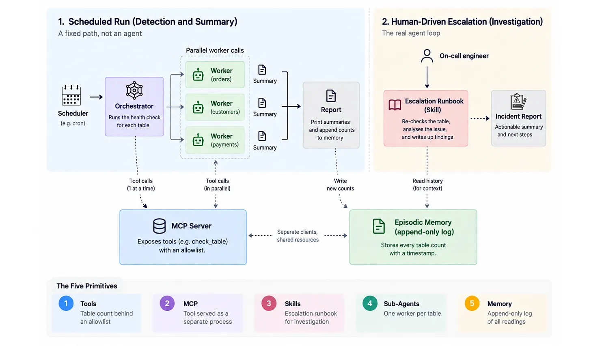

# Part 7 — Putting It All Together: A Pipeline Health Monitor

Code for [Agents in Action #7](https://pipeline2insights.substack.com) on [Pipeline to Insights](https://pipeline2insights.substack.com).



Every primitive from the series, each earning its place for a specific reason — not included just because it exists. Four files: `mcp_server.py`, `pipeline_monitor.py`, `.claude/skills/pipeline-incident-escalation/SKILL.md`, and `escalate_agnostic.py` (the same skill, no Claude Code needed).

| Primitive | Where | Why this one, here |
|---|---|---|
| **Tool** (Part 2) | `check_table` in `mcp_server.py` | A row count must be exact. An LLM guessing is worse than useless. |
| **MCP** (Part 3) | `mcp_server.py` + the MCP client in `pipeline_monitor.py` | This capability now has **two independent consumers** — the automated monitor, and an on-call engineer's Claude Code session (see the skill below). Part 3's own rule: extract to MCP the moment a second client needs the same tool. |
| **Sub-agents** (Part 5) | `check_and_report`, fanned out over `ThreadPoolExecutor` | Three tables are independent work (Part 5's parallelism signal), and isolating each table in its own context prevents the cross-table mix-ups Part 5 warned about — one agent juggling three tables at once is exactly how a summary ends up attributing the wrong table's numbers to the wrong table. |
| **Memory** (Part 6) | `load_memory` / `save_memory`, backed by `episodic_memory.db` | Specifically **episodic memory** in Part 6's CoALA taxonomy — and append-only, not overwritten. A reader on Part 6 pointed out that overwriting a single JSON snapshot loses history: you can answer "did this change since last time" but never "what was true last Tuesday." Every run **inserts** a new row instead of replacing the old one, so both questions stay answerable. |
| **Skill** (Part 4) | `.claude/skills/pipeline-incident-escalation/` | **Procedural memory**, and deliberately *not* called by the script. Escalating is a judgement call for a human, not something the automation should do unsupervised. |

That last row is the point worth sitting with: Part 6 named four memory types (working, semantic, procedural, episodic) and this project uses two of them for two different jobs — episodic memory (`episodic_memory.db`) for "what changed," procedural memory (the skill) for "what to do about it." And the episodic half is the exact JSON-to-SQLite graduation Part 6 itself described: "move here when you need to query history, not just the last snapshot."

**One thing deliberately kept out of the model's hands:** deciding ANOMALY vs. OK is a fixed-threshold comparison — `classify_anomaly()` in `pipeline_monitor.py` is plain Python, not a Claude call. A percentage-drop rule is a rule, not a judgement call requiring interpretation, so it doesn't belong to a model — that's Part 2's own test for when a tool (or in this case, no tool at all, just code) is the right call, not an LLM. The one Claude call each worker makes is reserved for the part that actually needs language and judgement: writing the on-call sentence and suggesting likely causes.

## Setup

```bash
pip install -r requirements.txt
export ANTHROPIC_API_KEY="sk-ant-..."
```

`requirements.txt` pins to the versions this was actually tested against
(`fastmcp` 3.x, `anthropic` 0.x) — both projects are still pre-1.0 and can
ship breaking changes on an unpinned install.

## Run the automated monitor

```bash
python pipeline_monitor.py   # first run — seeds warehouse.db via mcp_server.py, no memory yet, records a baseline
python simulate_drop.py      # deletes 3,000 real rows from payments — simulates an incident
python pipeline_monitor.py   # second run — memory exists, the agent catches the real drop over MCP
```

`pipeline_monitor.py` launches `mcp_server.py` itself as a subprocess (stdio transport) — you don't need to run it separately for this part.

## Try the escalation skill (the human half)

This is the part that only makes sense once an anomaly has actually fired, and it runs through Claude Code, not the Python script:

```bash
claude mcp add warehouse -- python3 mcp_server.py   # register the same MCP server as a second client
```

Then, in a Claude Code session in this folder, after running the two `pipeline_monitor.py` runs above so `payments` is flagged:

```
> An anomaly was flagged on the payments table. What should I do?
```

Claude Code should recognise the request, load `pipeline-incident-escalation`, call the live `check_table` MCP tool to re-verify the current count, and produce an escalation message in the format the skill specifies — using the *same* MCP server the automated script used, not a re-implementation of the query.

## The same skill, with no Claude Code at all

Part 4 claimed that a Skill's *idea* — a runbook loaded only when a request matches, then followed — is universal, and that on another stack you'd build the same "load context on demand" behaviour yourself. `escalate_agnostic.py` proves that instead of just asserting it: it reads `SKILL.md` as a plain text file, does a hand-written keyword check in place of Claude Code's native discovery, and only then loads the runbook body into a normal `client.messages.create()` call — same MCP tool, same episodic memory log, no `.claude/skills/` convention, no `claude mcp add`.

```bash
python escalate_agnostic.py "An anomaly was flagged on the payments table. What should I do?"
python escalate_agnostic.py "What's the weather like today?"   # doesn't match — no runbook loaded, no tool call
```

Run it after the two `pipeline_monitor.py` runs above (so there's a baseline and a flagged drop to investigate) and it produces the same escalation message the skill specifies, using the monitor's own memory to find the pre-incident baseline.

## Files

| File | What it does |
|------|-------------|
| `mcp_server.py` | `check_table` (the Part 2 tool), exposed as an MCP server (Part 3) via FastMCP |
| `pipeline_monitor.py` | `gather_table_stats` (MCP client, sequential) + `init_memory_db`/`load_memory`/`save_memory` (append-only episodic memory in SQLite) + `classify_anomaly` (deterministic threshold check, not an LLM call) + `check_and_report` fanned out over `ThreadPoolExecutor` (sub-agents) + `run_health_check` (the orchestrator) |
| `simulate_drop.py` | Deletes 3,000 rows from `payments` in `warehouse.db` to simulate a real incident |
| `.claude/skills/pipeline-incident-escalation/SKILL.md` | The escalation runbook (procedural memory) — a human reaches for this via Claude Code, the script never calls it |
| `escalate_agnostic.py` | The same skill, loaded and followed without Claude Code — a hand-written trigger check + a plain Claude API call, proving the underlying idea isn't Claude-Code-specific |

## What you should see

First run (empty memory, fresh `warehouse.db`) — three workers run in parallel, each just recording a baseline:

```
=== orders ===
Table `orders` has 10,000 rows and is operating within baseline parameters—no action needed.

=== customers ===
`customers` table is at baseline with 5,400 rows—no historical comparison available yet, establishing this as the reference point.

=== payments ===
The payments table has 9000 rows and is operating at baseline expectations with no historical data to compare against.
```

After `simulate_drop.py`, second run (memory now has the first run's numbers) — same code, same MCP tool, `classify_anomaly` catches the drop deterministically, and the one Claude call per worker writes it up and suggests causes:

```
=== orders ===
The `orders` table is healthy with 10,000 rows unchanged since the last check.

=== customers ===
The `customers` table is operating normally with a stable row count of 5,400 records.

=== payments ===
The `payments` table has dropped to 6,000 rows from 9,000—check for a failed
ingestion job, incomplete backfill, or an accidental deletion in the source system.
```

## Proving the history actually survives

Run `pipeline_monitor.py` a third time, then query the log directly instead of just trusting the last printout:

```bash
python3 -c "
import sqlite3
conn = sqlite3.connect('episodic_memory.db')
for row in conn.execute('SELECT table_name, row_count, checked_at FROM readings ORDER BY table_name, checked_at'):
    print(row)
"
```

Real output from three runs:

```
('customers', 5400, '2026-08-31T12:04:53.898617+00:00')
('customers', 5400, '2026-08-31T12:06:45.137449+00:00')
('customers', 5400, '2026-08-31T12:12:02.709728+00:00')
('orders', 10000, '2026-08-31T12:04:53.895111+00:00')
('orders', 10000, '2026-08-31T12:06:45.133703+00:00')
('orders', 10000, '2026-08-31T12:12:02.706091+00:00')
('payments', 9000, '2026-08-31T12:04:53.900307+00:00')
('payments', 6000, '2026-08-31T12:06:45.139268+00:00')
('payments', 6000, '2026-08-31T12:12:02.711524+00:00')
```

Every reading from every run is still there. With the old JSON version, that second `payments` row would have overwritten the first — you'd never be able to see the exact moment it dropped, only that it's currently different from "last time."

Real output from `escalate_agnostic.py`, run against the same flagged state, no Claude Code involved:

```
Step 1: Re-check the table — confirmed via check_table: 6,000 rows
Step 2: Compare against the alert — Monitor's baseline: 9,000. Current: 6,000.
Drop: 3,000 rows (33.3%). Exceeds the 10% threshold — ACTIVE incident.
Step 3: Escalate —
🔴 INCIDENT — payments row count
Baseline: 9000 → Current: 6000 (33.3% drop)
Recommended: check upstream ingestion logs and recent DML history for
payments before the next scheduled load runs.
```

Same tool, same memory, same runbook, same conclusion — with a keyword check standing in for Claude Code's discovery.

## Why MCP calls run sequentially, not fanned out like the sub-agents

`gather_table_stats` awaits one MCP call after another instead of parallelising them. The official MCP client is asyncio-based; the sub-agent fan-out below it is thread-based (`ThreadPoolExecutor`, per Part 5). Mixing one shared async session across worker threads is a real source of bugs for very little payoff — these are fast local SQLite queries. If you point `check_table` at a slow production warehouse, that's the point where parallelising the MCP calls (with `asyncio.gather`) would start to pay for the added complexity.

## The orchestrator/worker hand-off risk

Every worker above returns a correct result on its own. The thing worth testing separately is whether the orchestrator relays that result faithfully — with three parallel workers writing to a shared `results` list and printing independently, a bug in how `run_health_check` collects them could silently misattribute one table's finding to another, even though every individual `check_and_report` call was correct. Test the hand-off, not just each piece in isolation.

## Adapting this to your own pipeline

- **Point it at your real warehouse.** `check_table` in `mcp_server.py` runs `SELECT COUNT(*)` over a SQLite connection so the demo has no external dependencies. Swap the connection for your real Postgres/Snowflake/BigQuery client — nothing in `pipeline_monitor.py` or the skill needs to change, because they only ever see the MCP tool's contract.
- **Swap the table list.** Edit `TABLES_TO_MONITOR` at the top of `pipeline_monitor.py`; `ALLOWED_TABLES` in `mcp_server.py` should match.
- **Change the sensitivity.** `THRESHOLD_PCT` is a single constant in `pipeline_monitor.py`, read directly by `classify_anomaly` — nothing else to edit.
- **Change the escalation procedure.** Edit `SKILL.md` — the channel name, the message format, the recommended actions — without touching any code.
- **Use a different model provider.** Only `client = Anthropic()` and `model=` in `run_subagent` are Claude-specific. If you're on Ollama, Mistral, or another provider, swap the client initialisation the same way described in Part 2 — the tool, MCP transport, memory store, and skill are all provider-agnostic.

`warehouse.db` and `episodic_memory.db` are both gitignored — delete them and rerun `pipeline_monitor.py` to start over from a clean history.
